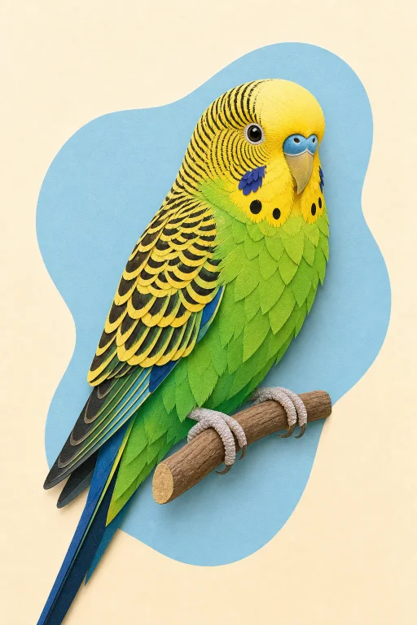

# Pet Trivia With Friends (PTWF)

Pet Trivia With Friends is a real-time multiplayer game about responsible pet care. Players join a shared lobby, choose an animal and a care theme, then answer a fresh set of multiple-choice questions together. Each game includes timed rounds, live answer tallies, and a final leaderboard.

The initial animal catalogue includes dogs, cats, birds, and fish. Care themes cover diet and nutrition, grooming and bathing, health and wellbeing, behaviour and communication, training and enrichment, homes and habitats, and safety and first aid.

The app is built on Next.js with Convex as the serverless backend, providing a real-time database and live synchronisation across all connected clients. Pet-care question generation is handled by Gemini via OpenRouter, with a curated animal catalogue and original illustrations bundled into the app.

<table>
  <tr>
    <td></td>
    <td></td>
    <td></td>
    <td></td>
  </tr>
</table>

## Setup

Create a [Convex](https://convex.dev) account, follow their getting-started guide, then copy `.env.example` to `.env` and set `NEXT_PUBLIC_CONVEX_URL` to your deployment URL. Create an [OpenRouter](https://openrouter.ai) account, generate an API key, and add it as `OPENROUTER_API_KEY` in your Convex dashboard environment variables.

## Usage

```bash
pnpm install    # Install dependencies
pnpm dev        # Run Next.js & Convex dev servers
pnpm build      # Build Next.js
pnpm format     # Format
pnpm lint       # Lint
pnpm typecheck  # Typecheck
pnpm test       # Test
```

## Structure

```bash
apps/
  nextjs/       # Next.js frontend
  convex/       # Convex backend & database
packages/
  ui/           # Shared shadcn/ui components
tooling/
  eslint/       # ESLint config
  prettier/     # Prettier config
  tailwind/     # Tailwind CSS config
  typescript/   # TypeScript config
```
