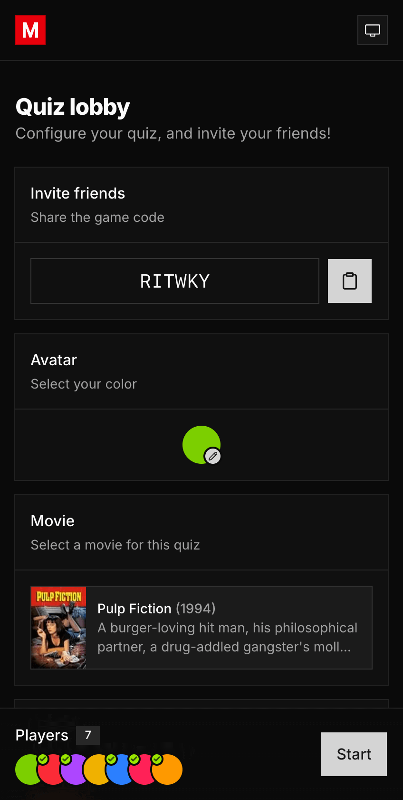
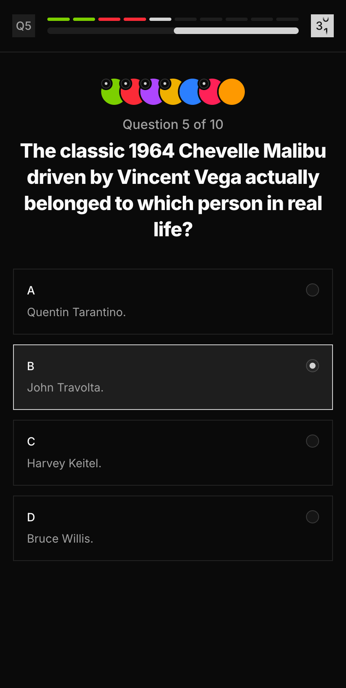
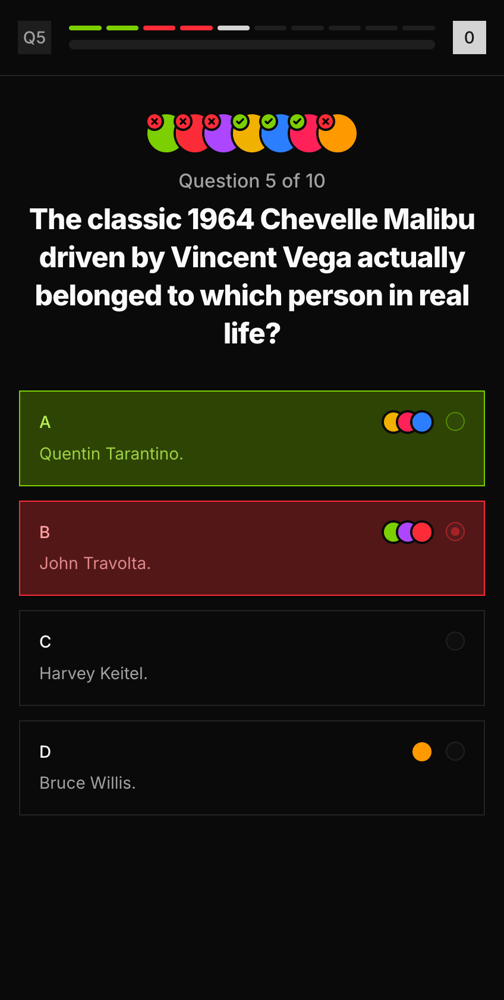
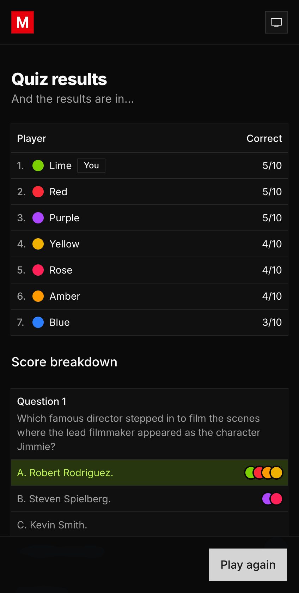

# Movie Trivia with Friends (MTWF)

Movie Trivia with Friends is a real-time multiplayer trivia game centred around film. Players join a shared lobby, select a movie to quiz on, and choose from several themes that influence how questions are written and presented. An LLM then generates a fresh set of multiple-choice questions for the group to answer, with timed rounds, live vote tallies, and a final leaderboard.

The app is built on Next.js with Convex as the serverless backend, providing a real-time database and live synchronisation across all connected clients. Question generation is handled by Gemini via OpenRouter, with movie metadata sourced from TMDB.

<table>
  <tr>
    <td></td>
    <td></td>
    <td></td>
    <td></td>
  </tr>
</table>

## Setup

Create a [Convex](https://convex.dev) account, follow their getting-started guide, then copy `.env.example` to `.env` and set `NEXT_PUBLIC_CONVEX_URL` to your deployment URL. Create a [TMDB](https://www.themoviedb.org) account, generate a read-access token, and add it as `TMDB_ACCESS_TOKEN` in your Convex dashboard environment variables. Create an [OpenRouter](https://openrouter.ai) account, generate an API key, and add it as `OPENROUTER_API_KEY` in your Convex dashboard environment variables.

## Usage

```bash
pnpm install    # Install dependencies
pnpm dev        # Run Next.js & Convex dev servers
pnpm build      # Build Next.js
pnpm format     # Format
pnpm lint       # Lint
pnpm typecheck  # Typecheck
pnpm test       # Test
```

## Structure

```bash
apps/
  nextjs/       # Next.js frontend
  convex/       # Convex backend & database
packages/
  ui/           # Shared shadcn/ui components
tooling/
  eslint/       # ESLint config
  prettier/     # Prettier config
  tailwind/     # Tailwind CSS config
  typescript/   # TypeScript config
```
