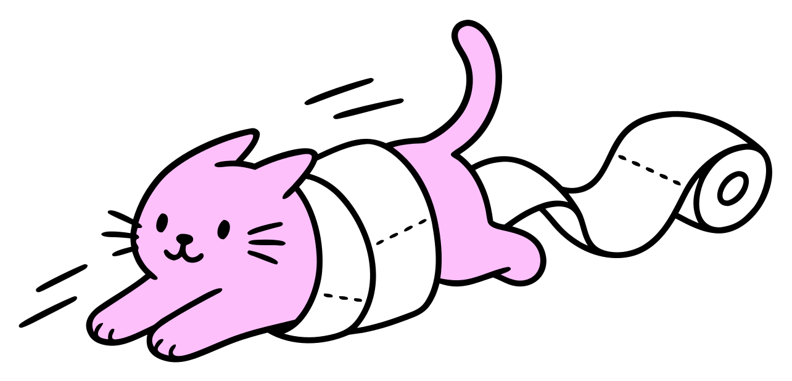

# All about pets!

A multiplayer trivia game about responsible pet care. Choose a pet and care topic, invite your friends, and compete in timed rounds of AI-generated questions.

Adapted from an [earlier multiplayer trivia game](https://github.com/ryanpwaldon/mtwf) I built.

## Development

Create a [Convex](https://convex.dev/) account, follow its getting-started guide, then copy `.env.example` to `.env` and set `NEXT_PUBLIC_CONVEX_URL` to your deployment URL. Create an [OpenRouter](https://openrouter.ai/) account, generate an API key, and add it as `OPENROUTER_API_KEY` in your Convex dashboard environment variables.

```bash
pnpm install
pnpm dev
```
